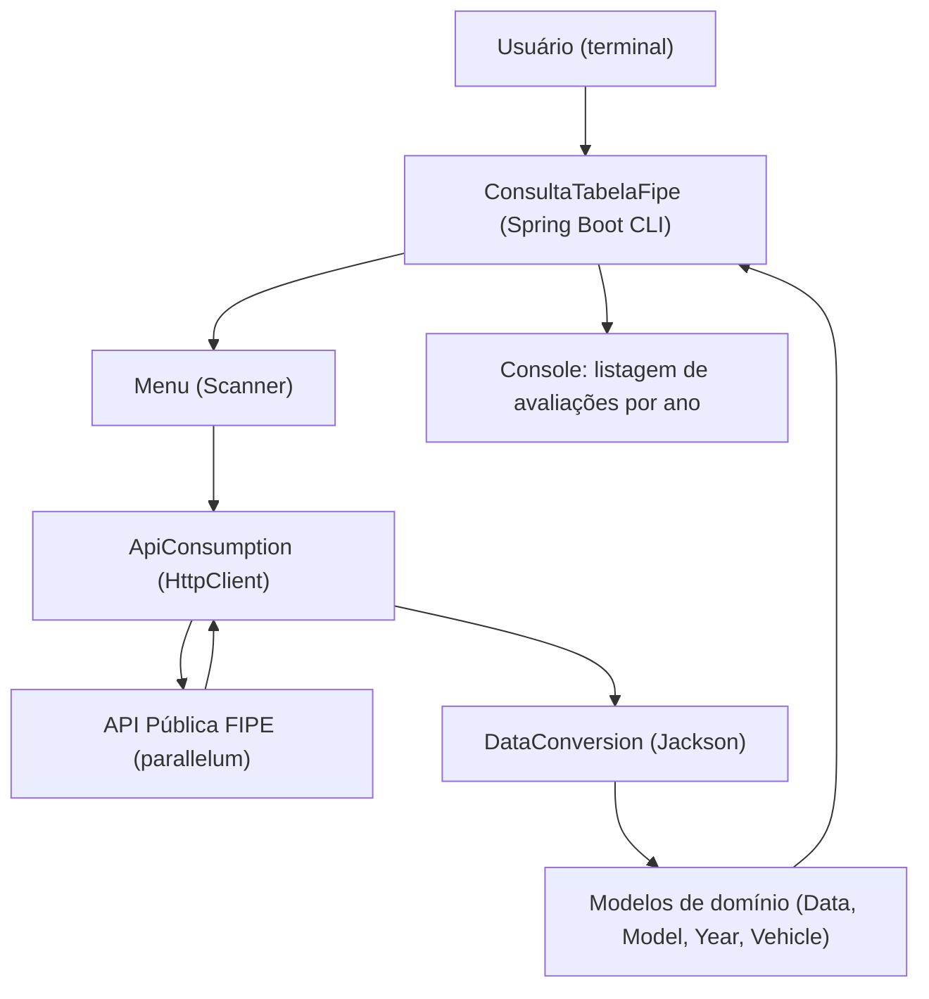

 # Consulta Tabela FIPE

Uma aplicação CLI em Java 21 + Spring Boot para consultar a tabela FIPE e agregar avaliações históricas de veículos (marca → modelo → todos os anos disponíveis). Demonstra integração com APIs públicas, transformação de dados, tratamento de erros e apresentação limpa em console.

Problema resolvido
---------------------------------
Esta aplicação permite que um usuário selecione o tipo de veículo (carros, motos ou caminhões), escolha uma marca e um modelo e receba todas as avaliações históricas daquele modelo, consumindo a API pública FIPE. Soluciona a necessidade de agregar e apresentar em lote as avaliações por ano — útil para análises ou pipelines que dependam de valores históricos.

Motivação
---------
- Exercitar integração com APIs REST externas e desserialização JSON (Jackson).
- Demonstrar uso de Java moderno (records, streams) e Spring Boot (CLI via CommandLineRunner).
- Mostrar decisões de design para modelagem de dados e tratamento de conversões e erros.

Stack tecnológica e papel de cada componente
-------------------------------------------
- Java 21 — linguagem principal, uso de features modernas (records, switch expressions).
- Spring Boot 4 — execução da aplicação via `CommandLineRunner` e bootstrap do app.
- Jackson (`jackson-databind`) — desserialização JSON para DTOs e entidades.
- java.net.http.HttpClient — consumo HTTP das APIs públicas (sem dependências externas extras).
- Maven (`mvn` / `./mvnw`) — build, dependências e execução.

Arquitetura (visão geral)
------------------------



Decisões de design e trade-offs
-------------------------------
- Organização simples de pacotes: `model` (DTOs/entidades), `service` (consumo/transformação) e `principal` (orquestração CLI) — facilita leitura e é suficiente para este escopo.
- `record` para DTOs (responses) reduz boilerplate e torna claro o contrato de entrada JSON.
- Conversão para classes POJO de domínio permite tratamento de exceções (ex.: NumberFormatException) e enriquecimento de dados.
- As requisições por ano são executadas sequencialmente (simplicidade). Para produção, consideraria chamadas assíncronas controladas (CompletableFuture) com limite de concorrência.

Contratos e API pública consumida
---------------------------------
API pública base (documentação): https://deividfortuna.github.io/fipe/

Principais endpoints usados:

- Listar marcas: `GET https://parallelum.com.br/fipe/api/v1/{tipo}/marcas`
- Listar modelos: `GET https://parallelum.com.br/fipe/api/v1/{tipo}/marcas/{codigoMarca}/modelos`
- Listar anos: `GET https://parallelum.com.br/fipe/api/v1/{tipo}/marcas/{codigoMarca}/modelos/{codigoModelo}/anos`
- Avaliação por ano: `GET https://parallelum.com.br/fipe/api/v1/{tipo}/marcas/{codigoMarca}/modelos/{codigoModelo}/anos/{codigoAno}`

Exemplos com `curl`:
```bash
# listar marcas de carros
curl -s "https://parallelum.com.br/fipe/api/v1/carros/marcas" | jq .

# listar modelos da marca 21
curl -s "https://parallelum.com.br/fipe/api/v1/carros/marcas/21/modelos" | jq .

# listar anos do modelo 560 (exemplo)
curl -s "https://parallelum.com.br/fipe/api/v1/carros/marcas/21/modelos/560/anos" | jq .

# valor para ano específico
curl -s "https://parallelum.com.br/fipe/api/v1/carros/marcas/21/modelos/560/anos/2003-1" | jq .
```

Guia de execução com "zero fricção"
----------------------------------
Pré-requisitos:
- Java 21 instalado (JAVA_HOME configurado)
- Maven ou usar o wrapper incluído (`./mvnw`)
- Acesso à internet (consome API pública)

Execução rápida:
```bash
# executar com o wrapper (Linux/macOS)
./mvnw spring-boot:run

# ou com maven local
mvn spring-boot:run
```

Gerar JAR e executar:
```bash
./mvnw -DskipTests package
java -jar target/consulta-tabela-FIPE-0.0.1-SNAPSHOT.jar
```

Testes
------
```bash
# rodar todos os testes
./mvnw test

# (opcional) gerar relatório de cobertura: adicionar Jacoco no pom e rodar
./mvnw test jacoco:report
```

Status do projeto: o que está implementado e próximos passos
----------------------------------------------------------
Implementado:

- Fluxo CLI completo: seleção de tipo → marcas → modelos → anos → agregação de avaliações por ano.
- Conversão JSON → DTOs (records) e DTOs → entidades de domínio.
- Tratamento básico de parsing numérico e erros de IO.

Pontos a completar / melhorias:

- Padronizar/formatar `toString()` das models para saída mais legível (feito parcialmente).
- Paralelizar requisições por ano para reduzir latência (usar `CompletableFuture` ou ExecutorService).
- Adicionar testes de integração (WireMock) e cobertura automatizada (JaCoCo).
- Adicionar Dockerfile / docker-compose para execução com um único comando.
- Expor a aplicação como REST com documentação OpenAPI/Swagger.

Contribuição
----------------------
- Contribuições são bem-vindas: abra uma issue ou PR descrevendo a mudança.
